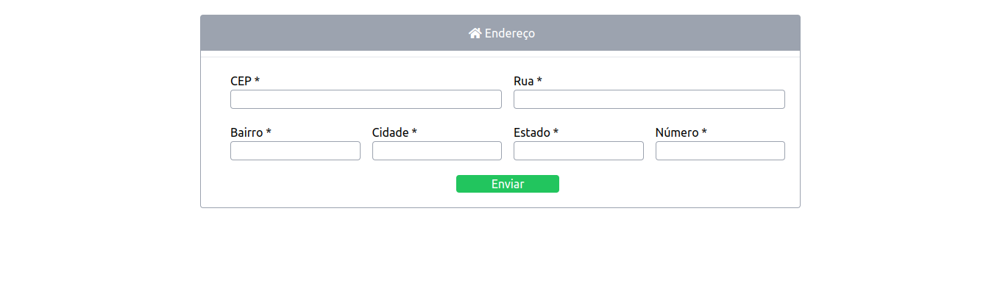

# Zip code

Consult Brazilian zip code

## About the project

This project consists of consuming an API viacep

## Project demo

Photo

Final result: https://react-zip-code.netlify.app/

## Project's goal

Project developed to train React Hooks and consume API

## Technologies Used in the Project

Project made using the following languages/technologies:

* React Hooks
* API viacep
* Tailwind.css

## installation

In order for this project to run on your machine, follow the steps below:

Clone this repository into a folder on your machine  
$ git clone https://github.com/Leveditor/Cep.git  

Enter the folder
$ cd Movie2.0  

Install the dependencies by typing in the terminal:  
$ npm install  

Run the application in development mode:  
$ npm start

You must open port http://localhost:3000 in your browser to see the project.
